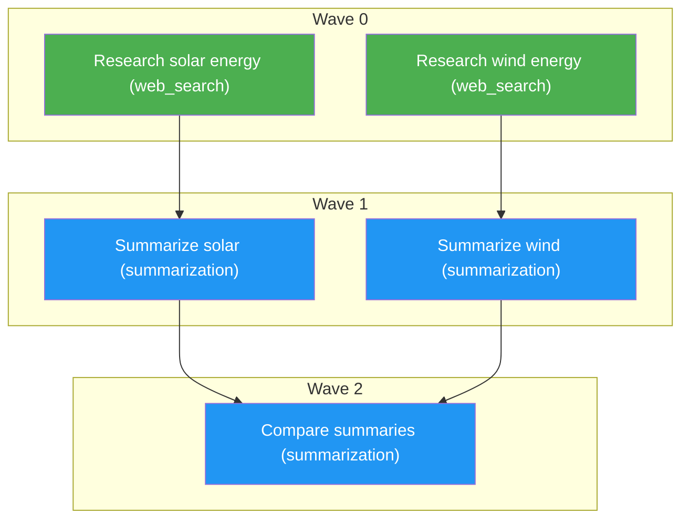

## How AOS v0.0.2 plans and executes tasks

AOS decomposes a user job into a **task graph** — a directed acyclic graph
(DAG) of **nodes** connected by **edges**.

- **Node:** a single unit of work. Each node has a unique `id`, a `description`
  (which doubles as the instruction passed to its capability), a `capability`
  (the tool it calls, e.g. `web_search`, `summarization`, or `vision`), and a
  `depends_on` list of node ids it must wait for.
- **Edge:** a dependency from one node to another. If node C has
  `depends_on: ["a", "b"]`, it runs only after both A and B finish, and
  receives their outputs as input.

**Concurrency:** nodes in the same dependency "wave" are independent and run
concurrently via threads. For example, in the graph below, nodes `a` and `b`
run in parallel, then `c` and `d` run in parallel, and finally `e` runs.

**Multi-parent merging:** a node with multiple parents receives the labeled,
concatenated outputs of all its parents, so it can compare, combine, or
reconcile them.

**Diagrams:** the Mermaid diagrams in `outputs/plan.md` are generated
deterministically from the validated graph by `diagram_utils.build_mermaid()`,
not by the LLM. This is a deliberate reliability choice — the diagram always
faithfully represents the actual graph structure, wave assignments, and
capability types, with no risk of the LLM inventing or omitting nodes.

