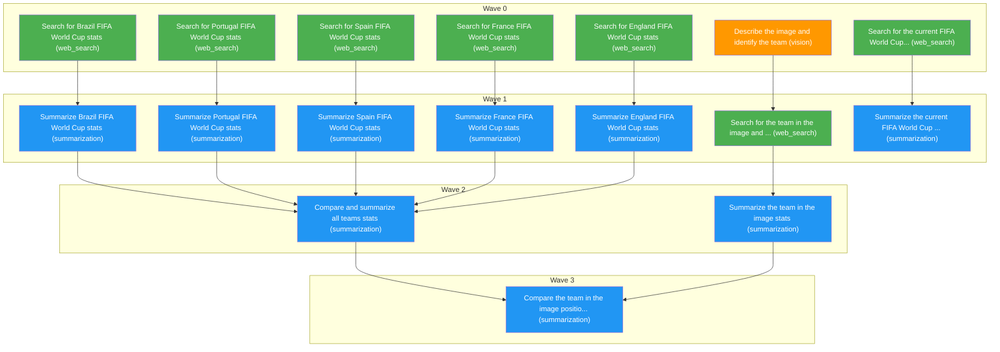

# Task Plan
**Job:** FIFA World Cup analysis

| # | Node ID | Description | Capability | Depends On |
|---|---------|-------------|------------|------------|
| a | a | Describe the image and identify the team | vision | - |
| b | b | Search for Brazil FIFA World Cup stats | web_search | - |
| c | c | Search for Portugal FIFA World Cup stats | web_search | - |
| d | d | Search for Spain FIFA World Cup stats | web_search | - |
| e | e | Search for France FIFA World Cup stats | web_search | - |
| f | f | Search for England FIFA World Cup stats | web_search | - |
| g | g | Summarize Brazil FIFA World Cup stats | summarization | b |
| h | h | Summarize Portugal FIFA World Cup stats | summarization | c |
| i | i | Summarize Spain FIFA World Cup stats | summarization | d |
| j | j | Summarize France FIFA World Cup stats | summarization | e |
| k | k | Summarize England FIFA World Cup stats | summarization | f |
| l | l | Compare and summarize all teams stats | summarization | g, h, i, j, k |
| m | m | Search for the team in the image and its stats | web_search | a |
| n | n | Summarize the team in the image stats | summarization | m |
| o | o | Search for the current FIFA World Cup champion | web_search | - |
| p | p | Summarize the current FIFA World Cup champion | summarization | o |
| q | q | Compare the team in the image position with other teams | summarization | l, n |

**Waves:** Wave 0: a, b, c, d, e, f, o | Wave 1: m, g, h, i, j, k, p | Wave 2: n, l | Wave 3: q

