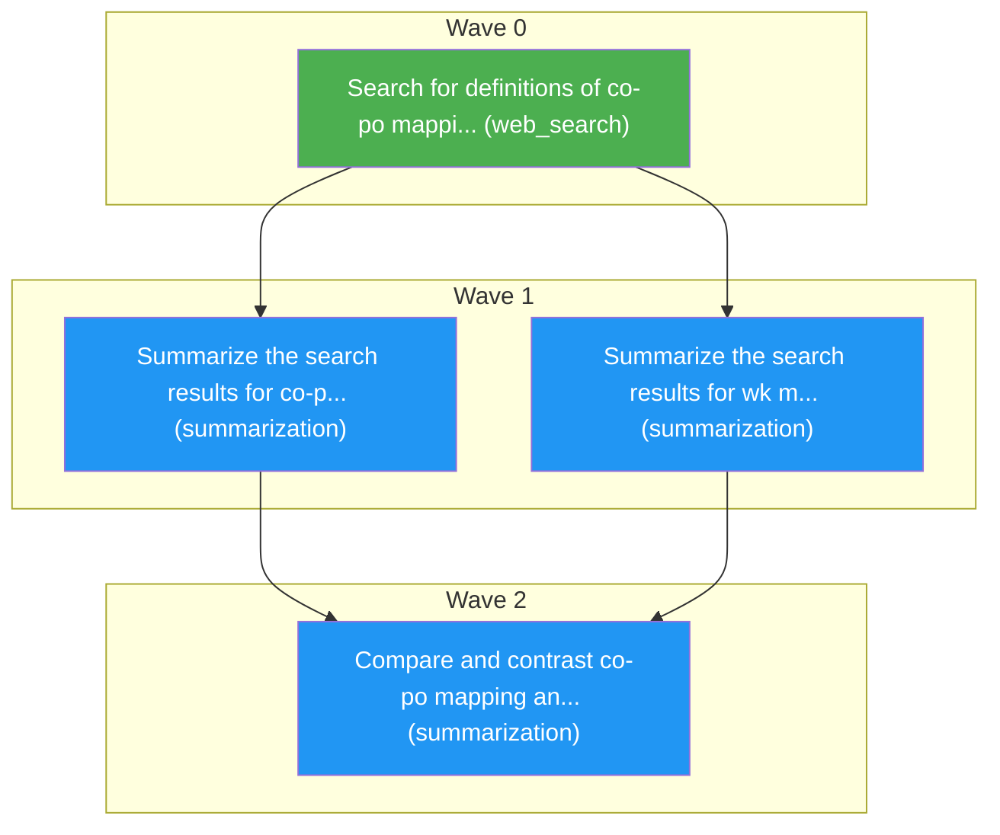

# Task Plan
**Job:** define co-po mapping with wk mapping

| # | Node ID | Description | Capability | Depends On |
|---|---------|-------------|------------|------------|
| a | a | Search for definitions of co-po mapping and wk mapping | web_search | - |
| b | b | Summarize the search results for co-po mapping | summarization | a |
| c | c | Summarize the search results for wk mapping | summarization | a |
| d | d | Compare and contrast co-po mapping and wk mapping based on the summaries | summarization | b, c |

**Waves:** Wave 0: a | Wave 1: b, c | Wave 2: d

